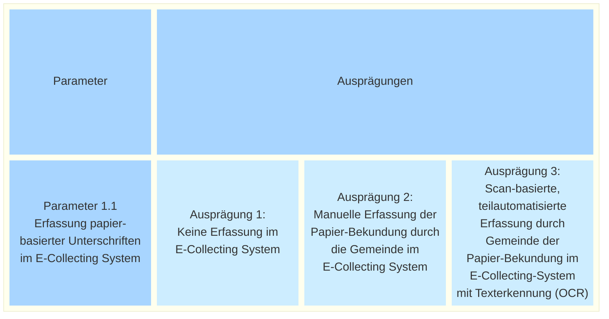

# E-Collecting Plattform

* [Link to "Aktuell"](#Aktuell)
* [Link to "Dokumente und Protokolle"](#Dokumente-und-Protokolle)
* [Link to "Anderer Titel"](#1-1-anderer-titel)

* _[Deutsche Version](#deutsch--e-collecting-plattform)_

## Aktuell

...

## Dokumente und Protokolle

...

## <a name="1-1-anderer-titel">1.1 Anderer Titel</a>

...

# <a name="deutsch--e-collecting-plattform">Deutsch: E-Collecting-Plattform</a>

# Mermaid

style t1  fill:#2068c7,stroke:#208ac7,stroke-width:4px,color:#999,primaryTextColor:#090
